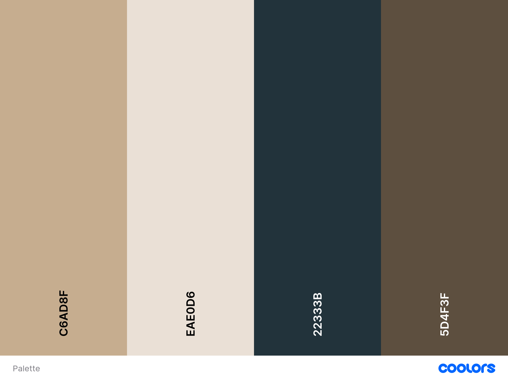

# 📘 Projeto Final — Técnico em Desenvolvimento de Sistemas

---

---

## 📂 Descrição do Repositório

Este repositório reúne todo o desenvolvimento do projeto final do curso Técnico em Desenvolvimento de Sistemas, contemplando **Front-end** e **Back-end**.  
As atualizações são frequentes para garantir o progresso contínuo e o versionamento seguro dos arquivos.

---

## 🛠️ Tecnologias e Ferramentas Utilizadas

- **Prisma**
- **XAMPP**
- **JavaScript**
- **HTML5**
- **CSS3**
- **Node.js**
- **Insomnia**
- **Google Books API**
- **Visual Studio Code**
- **Figma**

---

## 📌 Backlog Geral do Projeto

- [x] Escolha da metodologia (SCRUM, KANBAN, XP ou outra)
- [x] Definição de papéis e responsabilidades
- [x] Modelagem do negócio com [Canvas](https://wellifabio.github.io/canvas/)
- [x] Apresentação da proposta inicial
- [x] Criação do cronograma com [Gráfico de Gantt](https://wellifabio.github.io/gantt/)
- [x] Criação do repositório no GitHub e adição dos colaboradores
- [x] Desenvolvimento do protótipo funcional
- [x] Levantamento dos requisitos funcionais com Diagramas de Casos de Uso (DCU)
- [x] Modelagem do banco de dados (MER e DER)
- [x] Criação do Diagrama de Classes (DC) para o Back-End
- [x] Início do desenvolvimento do banco de dados
- [x] Início do desenvolvimento do Back-End
- [x] Início do desenvolvimento do Front-End
- [x] Início da versão Mobile (layout no Figma)
- [ ] Criação do Triângulo de Ferro
- [ ] Criação da Matriz SWOT

---

## 🚀 Backlog da Sprint Atual

- [x] Criar repositório no GitHub e adicionar colaboradores  
  - [x] Enviar link via [formulário oficial](https://docs.google.com/forms/d/e/1FAIpQLSdLh0XsKBlFx1N8lw6gY3bZ6p7Ex01N39sIdodaG4Ka-NJgtA/viewform?usp=dialog)
- [x] Criar o protótipo funcional inicial
- [ ] Levantar os requisitos funcionais com suas respectivas prioridades
- [x] Ilustrar os requisitos com Diagramas de Casos de Uso (DCU)
- [x] Modelar o banco de dados (MER e DER)
- [x] Criar o Diagrama de Classes do Back-End

---

## 📅 Cronograma de Apresentações

### ✅ Datas

#### 📆 25/04 — Apresentação inicial do projeto  
- Demonstração do Front-End (visual e estrutura)  
- Progresso do Back-End (lógica e funcionamento)  

#### 📆 16/06

- UML DC (Diagrama de Classes) Back-End
- UML DA (Diagrama de Atividades) Front-End
- Análise de viabilidade: Matriz SWOT
- Triângulo de Ferro: Escopo, Prazo e Custo
- Iniciar a codificação/desenvolvimento do Banco de Dados
- Iniciar a codificação/desenvolvimento do Back-End
- Protótipo Figma Front-End
- Iniciar a codificação/desenvolvimento do Front-End
- Protótipo Figma Mobile
- Iniciar a codificação/desenvolvimento do Mobile

---

## 📈 Links Úteis

- [Canvas do Projeto](https://wellifabio.github.io/canvas/)
- [Gráfico de Gantt](https://wellifabio.github.io/gantt/)
- [Formulário de envio do repositório](https://docs.google.com/forms/d/e/1FAIpQLSdLh0XsKBlFx1N8lw6gY3bZ6p7Ex01N39sIdodaG4Ka-NJgtA/viewform?usp=dialog)